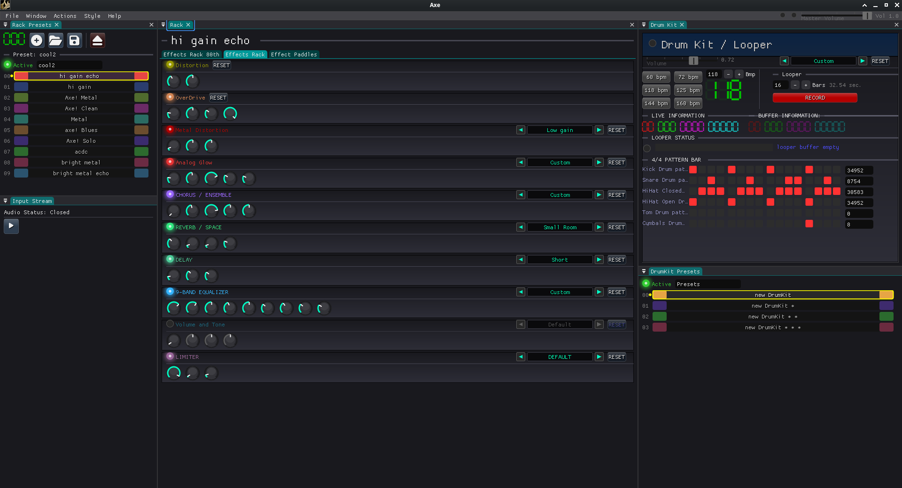

# 🎸 Ohmtal Axe
## by T.Hühn (XXTH) 2026

Ohmtal Axe is a cross platform Guitar Effect Machine with Drum Kit and Looper. 

--- 

In this Project I use: 

- Framework: [OhmFlux](https://github.com/ohmtal/OhmFlux)
- DSP Effects: [DSP](https://github.com/ohmtal/OhmFlux/tree/main/engine/dsp)
- Backend: [SDL3](https://www.libsdl.org/)
- Gui: [Dear ImGui](https://github.com/ocornut/imgui)
- Development
    - IDE/Text: [KDevelop](https://kdevelop.org/), [Kate](https://apps.kde.org/kate/)
    - Devel/Testing OS: [Arch Linux](https://archlinux.org/), [FreeBSD](https://freebsd.org/)

    
---

